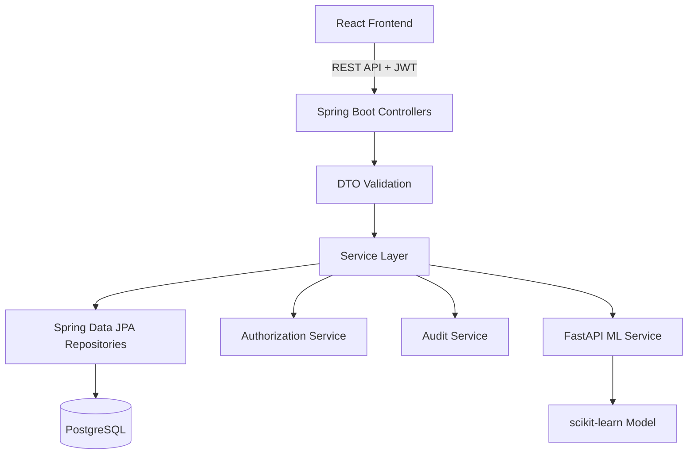

# MedFlow

> [!IMPORTANT]
> **Live demo link is provided in my resume.**

MedFlow is a full-stack clinic and EHR-style management system built with Spring Boot, React, PostgreSQL, and a small FastAPI-based ML service. It models the everyday flow of a clinic: patients register, doctors manage appointments, clinical notes are created after visits, prescriptions are shared with patients, and important actions are recorded in audit logs.

The project is meant to show practical software engineering around authentication, authorization, database design, REST APIs, UI workflows, testing, and service integration. It is not a real medical product, not clinically validated, and should only be used with synthetic demo data.

## Demo Accounts

All demo accounts use this password:

```text
Password123!
```

| Role | Email |
| --- | --- |
| Admin | `admin@medflow.demo` |
| Doctor | `doctor.asha@medflow.demo` |
| Doctor | `doctor.rohan@medflow.demo` |
| Patient | `patient.priya@medflow.demo` |
| Patient | `patient.tara@medflow.demo` |

## What The App Covers

MedFlow has three roles: patient, doctor, and admin.

Patients can create an account, maintain their profile, browse doctors, pick a date to see free appointment slots, book or cancel appointments, and view their own timeline, medical history, and prescriptions.

Doctors can see assigned appointments, open connected patient records, create encounters, add diagnoses, create prescriptions, and use the symptom pattern classifier as an educational support feature.

Admins can create doctor accounts and review audit logs. Public registration is intentionally limited to patient accounts, so users cannot choose their own role during signup.

## Main Features

- Patient registration and login
- Admin-created doctor accounts
- JWT authentication with BCrypt password hashing
- Role-based and resource-level authorization
- IDOR protection for patient, appointment, and clinical records
- Fixed 30-minute appointment slots
- Double-booking protection using a PostgreSQL partial unique index
- Encounter workflow that marks an appointment as completed
- Diagnosis and prescription management
- Audit logging for important successful actions
- React dashboard UI for patient, doctor, and admin roles
- Patient timeline and doctor patient-record views
- Doctor-only ML-assisted symptom pattern classifier
- MedFlow Guide companion for feature help and basic specialization guidance
- Docker Compose and GitHub Actions configuration

## Tech Stack

| Area | Technology |
| --- | --- |
| Backend | Java 17, Spring Boot, Spring MVC, Spring Data JPA |
| Security | Spring Security, JWT, BCrypt |
| Database | PostgreSQL, Flyway |
| Frontend | React, TypeScript, Vite, Axios, React Router |
| ML service | Python, FastAPI, scikit-learn, pandas, joblib |
| Testing | JUnit 5, Mockito, MockMvc, Spring Boot Test, H2 test profile, pytest |
| Tooling | Maven, npm, Docker Compose, GitHub Actions, Swagger/OpenAPI |

## System Design

The main application is a layered Spring Boot backend with a React frontend. The symptom classifier runs separately as a FastAPI service, and the backend calls it when a doctor uses the ML page.



The backend follows a simple controller, DTO, service, repository structure. DTOs keep the API contract separate from JPA entities, while services hold the main business rules such as appointment validation, ownership checks, clinical access rules, and audit logging.

## Security Approach

MedFlow uses stateless JWT authentication. After login, the backend validates the password using BCrypt and returns a JWT. The frontend sends that token with API requests, and Spring Security checks whether the user is authenticated and allowed to access the endpoint.

The important part is that authorization is not only based on role. For example, a patient can be logged in and still be blocked from another patient's appointments. A doctor can access clinical records only when there is a scheduled or completed appointment relationship with that patient. Cancelled appointments alone do not grant clinical access.

The frontend has protected routes to guide the user experience, but the backend remains the actual security boundary.

## Appointment Design

Appointments use fixed 30-minute slots. When a patient selects a doctor and date, the backend returns the free slots for that day. The booking service validates the doctor, appointment time, slot boundary, and current user before creating the appointment.

Cancelled appointments stay in the database because they are part of the patient's history. To make rebooking possible, the database only blocks duplicate scheduled appointments:

```sql
CREATE UNIQUE INDEX ...
ON appointments (doctor_id, appointment_date_time)
WHERE status = 'SCHEDULED';
```

This means the same doctor and time cannot have two active scheduled appointments, but a cancelled slot can be booked again.

## Clinical Workflow

The clinical flow starts from an appointment. A doctor creates an encounter for an assigned scheduled appointment, and that same transaction marks the appointment as completed. Diagnoses and prescriptions are then connected to the encounter.

This keeps the clinical records tied to an actual appointment instead of letting clients send arbitrary patient or doctor IDs. It also makes the workflow easier to explain: appointment first, encounter after the visit, then diagnosis and prescription.

## ML-Assisted Symptom Classifier

MedFlow includes a doctor-only symptom pattern classifier. It is a separate FastAPI service that loads a pre-trained scikit-learn `joblib` model. The Spring Boot backend exposes the feature through protected endpoints, so the React frontend never calls the ML service directly.

The classifier returns broad educational information such as:

- likely symptom pattern
- likely cause category
- confidence score
- alternative possibilities
- contributing factors
- safety flags
- suggested doctor questions

The model was trained on synthetic data only. It is useful for demonstrating ML service integration, but it is not a diagnosis tool and should not be treated as medical advice.

Current synthetic holdout metrics:

```text
Pattern accuracy: 0.902
Cause accuracy: 0.883
Training rows: 5000
Model version: synthetic-cause-logreg-v3
```

## MedFlow Guide

The frontend includes a small guide companion for new users. It explains where features are in the app and can suggest a starting doctor specialization from simple symptom keywords. For example, chest discomfort points toward cardiology, skin irritation points toward dermatology, and fever or cough points toward general medicine.

This guide is rule-based. It is meant to improve navigation and demo experience, not to replace medical judgement.

## Database

Flyway manages the schema, and Hibernate runs with `ddl-auto: validate`, so the application expects the entity model and migrations to stay aligned.

Main tables:

- `users`
- `patients`
- `doctors`
- `appointments`
- `encounters`
- `diagnoses`
- `prescriptions`
- `audit_logs`

Some database choices were made deliberately:

- `User` stores login credentials and role.
- `Patient` and `Doctor` profiles are separate from login data.
- Public registration does not accept a role from the client.
- Cancelled appointments are preserved for history.
- PostgreSQL enforces active appointment uniqueness.
- Audit logs avoid storing sensitive clinical details, passwords, or tokens.

## API Shape

The backend exposes REST APIs under:

```text
http://localhost:8080/api/v1
```

Important areas include:

- `/auth` for registration and login
- `/patients` for patient profile and clinical history
- `/doctors` for doctor listing
- `/admin/doctors` for admin-created doctor accounts
- `/appointments` for booking, viewing, cancelling, and available slots
- `/encounters` for visit records
- `/diagnoses` and `/prescriptions` through encounter and patient workflows
- `/admin/audit-logs` for audit review
- `/ml/symptom-pattern` for the doctor-only ML feature

Swagger UI is available when the backend is running:

```text
http://localhost:8080/swagger-ui/index.html
```

## Demo Data

The backend can seed synthetic demo users and clinic data when `DEMO_DATA_SEED_ENABLED=true`. Demo emails and the shared password are listed at the top of this README.

The seed data exists only to make the local UI feel populated during demos.

## Local Development

The project has three runnable parts:

- Spring Boot backend on `http://localhost:8080`
- React frontend on `http://localhost:5173`
- FastAPI ML service on `http://localhost:8000`

Typical local commands:

```bash
cd ml-service
pip install -r requirements.txt
python generate_data.py
python train.py
uvicorn app.main:app --reload --port 8000
```

```bash
cd backend
mvn -Dspring-boot.run.profiles=dev spring-boot:run
```

```bash
cd frontend
npm install
npm run dev
```

Environment examples are included in `.env.example`, `backend/.env.example`, and `frontend/.env.example`.

## Docker And CI

Docker Compose files are included for running PostgreSQL, the backend, the frontend, and the ML service together. The Docker setup is configured, but the full Compose runtime has not been verified on this machine because Docker Desktop daemon support is currently unavailable.

GitHub Actions is configured for backend tests, frontend build, and ML service tests. The frontend job currently uses `npm install` because `frontend/package-lock.json` has not been generated yet. Once a real lockfile is committed, the workflow can be switched to `npm ci` with npm caching.

## Testing

The project has a focused test suite rather than tests for every getter or simple repository save. The tests cover the behavior that matters most for this type of app:

- authentication and registration
- role assignment
- protected endpoints
- IDOR-style access checks
- appointment booking rules
- appointment conflict handling
- clinical workflow rules
- validation and global error responses
- audit logging
- ML service integration behavior

Local verification already completed:

```text
Backend: mvn -q test completed successfully with 131 tests passing.
Frontend: npm run build completed successfully.
ML service: pytest -q completed successfully with 7 tests passing.
Docker Compose: configured but not runtime-verified locally.
GitHub Actions: configured; remote CI should be checked after pushing.
```

The backend tests use H2 for fast local testing. H2 is useful for API, service, validation, and security tests, but it does not fully prove PostgreSQL-specific behavior such as the partial unique index. That behavior should be verified with PostgreSQL during Docker or deployment testing.

## Project Structure

```text
medflow/
|-- backend/
|   |-- src/main/java/com/medflow/
|   |-- src/main/resources/db/migration/
|   |-- src/test/java/com/medflow/
|   |-- pom.xml
|   |-- Dockerfile
|
|-- frontend/
|   |-- src/
|   |-- package.json
|   |-- Dockerfile
|   |-- nginx.conf
|
|-- ml-service/
|   |-- app/
|   |-- data/
|   |-- model/
|   |-- tests/
|   |-- generate_data.py
|   |-- train.py
|   |-- Dockerfile
|
|-- .github/workflows/ci.yml
|-- docker-compose.yml
|-- DOCKER.md
|-- README.md
```

## Limitations

MedFlow is a learning project and should be described honestly.

It is not HIPAA compliant, not clinically certified, not deployed as a production healthcare system, and not trained on real clinical data. JWTs are stored in `localStorage` for simplicity, refresh tokens are not implemented, and integrations such as real email, SMS, payments, file uploads, FHIR, monitoring, and backups are outside the current scope.

## Data Notice

All medical data in this repository should be synthetic demo data only.
